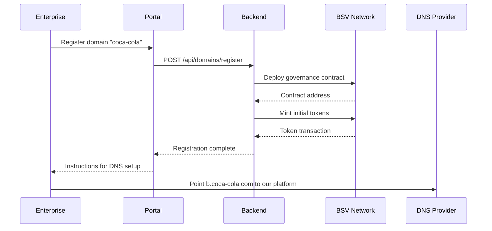
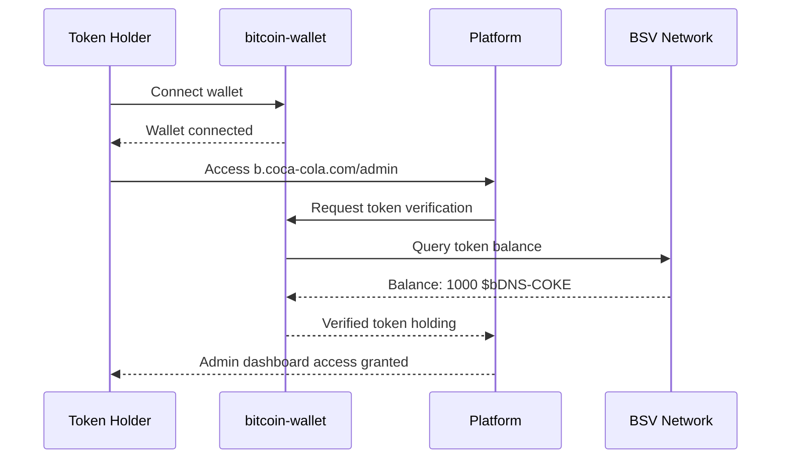
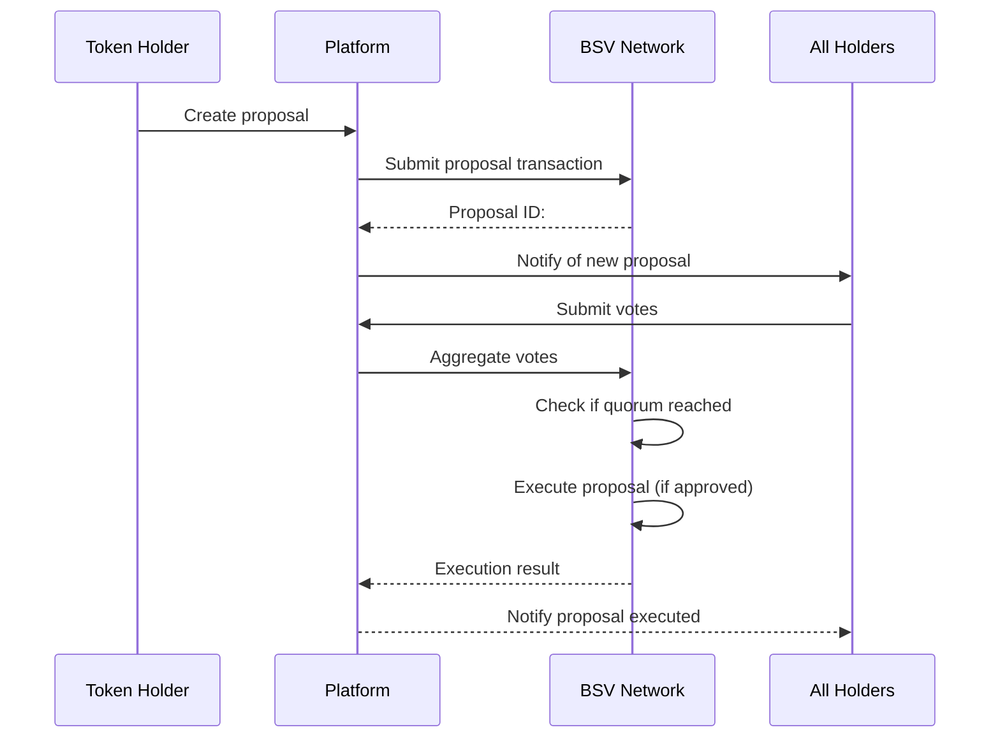

# Bitcoin DNS Architecture

## 🏛️ System Overview

Bitcoin DNS implements a hybrid architecture combining traditional DNS routing with blockchain governance, creating a seamless bridge between Web2 infrastructure and Web3 tokenomics.

## 🌐 High-Level Architecture

```
┌─────────────────┐    ┌──────────────────┐    ┌─────────────────┐
│   End User      │    │   Enterprise     │    │  Token Holders  │
│                 │    │                  │    │                 │
│ b.coca-cola.com │    │  coca-cola.com   │    │ bitcoin-wallet  │
└─────────────────┘    └──────────────────┘    └─────────────────┘
         │                       │                       │
         │ DNS Resolution        │ DNS Config            │ BRC-100 Auth
         ▼                       ▼                       ▼
┌─────────────────────────────────────────────────────────────────┐
│                    Bitcoin DNS Platform                        │
│  ┌─────────────────┐  ┌─────────────────┐  ┌─────────────────┐ │
│  │   Frontend      │  │    Backend      │  │   Blockchain    │ │
│  │   Next.js       │  │   Node.js       │  │   BSV + BRC     │ │
│  └─────────────────┘  └─────────────────┘  └─────────────────┘ │
└─────────────────────────────────────────────────────────────────┘
         │                       │                       │
         │                       │                       │
         ▼                       ▼                       ▼
┌─────────────────┐    ┌──────────────────┐    ┌─────────────────┐
│   Vercel CDN    │    │   Database       │    │   BSV Network   │
│   Global Edge   │    │   PostgreSQL     │    │   Mainnet       │
└─────────────────┘    └──────────────────┘    └─────────────────┘
```

## 🔧 Component Architecture

### Frontend Layer (Next.js 15)

#### Core Components
```typescript
src/
├── app/
│   ├── portal/              # Domain registration portal
│   ├── dashboard/           # Token holder dashboard
│   ├── templates/           # Subdomain template system
│   └── b/
│       └── [domain]/        # Dynamic subdomain pages
│           ├── page.tsx     # Public subdomain page
│           ├── admin/       # Token holder admin area
│           └── api/         # Domain-specific APIs
├── components/
│   ├── auth/               # BRC-100 wallet integration
│   ├── governance/         # Voting and proposal UI
│   ├── templates/          # Page builder components
│   └── shared/             # Reusable UI components
├── lib/
│   ├── wallet/             # bitcoin-wallet integration
│   ├── contracts/          # Smart contract interfaces
│   └── api/                # API client utilities
└── types/
    ├── governance.ts       # Governance types
    ├── templates.ts        # Template system types
    └── wallet.ts           # Wallet integration types
```

#### Authentication Flow
```typescript
// BRC-100 Wallet Authentication
interface WalletAuth {
  connectWallet(): Promise<WalletConnection>
  verifyTokenHolding(domain: string): Promise<TokenHolding>
  signGovernanceAction(proposal: Proposal): Promise<Signature>
}

// Token Holder Verification
interface TokenHolding {
  domain: string
  tokenSymbol: string  // e.g., $bDNS-COKE
  balance: number
  votingPower: number
  lastActivity: Date
}
```

### Backend Layer (Node.js + BSV)

#### API Architecture
```typescript
/api/
├── domains/
│   ├── register            # POST - Register new domain
│   ├── [domain]/
│   │   ├── governance      # GET/POST - Governance actions
│   │   ├── templates       # GET/PUT - Template management
│   │   └── analytics       # GET - Domain analytics
├── auth/
│   ├── wallet             # POST - Wallet authentication
│   └── verify             # POST - Token holding verification
├── governance/
│   ├── proposals          # GET/POST - Proposals CRUD
│   ├── votes              # POST - Submit votes
│   └── execution          # POST - Execute approved proposals
└── templates/
    ├── marketplace        # GET - Available templates
    └── deploy             # POST - Deploy template
```

#### Smart Contract Integration
```typescript
// Governance Contract Interface
interface GovernanceContract {
  createProposal(data: ProposalData): Promise<string>
  vote(proposalId: string, vote: Vote): Promise<Transaction>
  executeProposal(proposalId: string): Promise<Transaction>
  getTokenHolders(): Promise<TokenHolder[]>
  distributeRevenue(amount: number): Promise<Transaction>
}

// Revenue Distribution via X402
interface X402Integration {
  setupPaymentStreams(domain: string): Promise<void>
  distributeToHolders(revenue: Revenue): Promise<Transaction[]>
  getRevenueAnalytics(domain: string): Promise<Analytics>
}
```

### Blockchain Layer (BSV + BRC-100)

#### Smart Contract Stack
```solidity
// Simplified representation - actual implementation in BSV Script
contract DomainGovernance {
    struct Domain {
        string name;
        address contractAddress;
        uint256 totalSupply;
        mapping(address => uint256) tokenHolders;
        Proposal[] proposals;
    }
    
    struct Proposal {
        uint256 id;
        ProposalType proposalType;
        bytes data;
        uint256 votesFor;
        uint256 votesAgainst;
        uint256 executionTime;
        bool executed;
    }
    
    function createProposal(ProposalType _type, bytes _data) external;
    function vote(uint256 _proposalId, bool _support) external;
    function executeProposal(uint256 _proposalId) external;
    function distributeRevenue() external payable;
}
```

#### BRC-100 Protocol Integration
```typescript
// BRC-100 Token Standard Compliance
interface BRC100Token {
  symbol: string        // e.g., "bDNS-COKE"
  totalSupply: bigint
  decimals: number
  holders: Map<string, bigint>
  
  // Governance extensions
  votingPower(holder: string): bigint
  delegate(from: string, to: string): Transaction
  snapshot(): TokenSnapshot
}

// BRC-101 Governance Extensions
interface BRC101Governance {
  createProposal(proposal: Proposal): Transaction
  vote(proposalId: string, weight: bigint): Transaction
  execute(proposalId: string): Transaction
  getQuorum(): bigint
}
```

## 🔄 Data Flow

### Domain Registration Flow


### Token Holder Authentication Flow


### Governance Proposal Flow


## 🏗️ Infrastructure

### Deployment Architecture
```yaml
Production Environment:
  Frontend:
    - Vercel Edge Network
    - Global CDN distribution
    - Automatic scaling
    
  Backend:
    - Node.js on Railway/Vercel
    - Horizontal auto-scaling
    - Load balancing
    
  Database:
    - PostgreSQL (Supabase)
    - Real-time subscriptions
    - Automatic backups
    
  Blockchain:
    - BSV Mainnet
    - Multiple node providers
    - Redundant connections
    
  Monitoring:
    - Vercel Analytics
    - BSV blockchain monitoring
    - Custom metrics dashboard
```

### Security Considerations

#### Authentication Security
- **BRC-100 Wallet Integration**: Cryptographic signature verification
- **Token Verification**: Real-time blockchain balance checks
- **Session Management**: JWT with short expiration times
- **Rate Limiting**: API throttling and DDoS protection

#### Smart Contract Security
- **Multi-signature Requirements**: Critical actions require multiple signatures
- **Time Locks**: Governance proposals have mandatory delay periods
- **Access Controls**: Role-based permissions for different actions
- **Audit Trail**: All actions logged on-chain for transparency

#### Infrastructure Security
- **HTTPS Everywhere**: All communications encrypted
- **Input Validation**: Comprehensive sanitization and validation
- **Database Security**: Encrypted at rest and in transit
- **Environment Isolation**: Separate staging and production environments

## 📊 Performance Considerations

### Frontend Performance
- **Static Generation**: Pre-rendered pages for public content
- **Edge Caching**: Aggressive caching at CDN edge
- **Code Splitting**: Lazy loading of admin features
- **Image Optimization**: Automatic WebP conversion and sizing

### Backend Performance
- **Database Indexing**: Optimized queries for governance data
- **Caching Strategy**: Redis for frequently accessed data
- **Connection Pooling**: Efficient database connection management
- **Background Jobs**: Asynchronous processing for heavy operations

### Blockchain Performance
- **Transaction Batching**: Group multiple operations
- **State Caching**: Cache blockchain state locally
- **Selective Listening**: Only monitor relevant contract events
- **Fallback Providers**: Multiple BSV node connections

---

*This architecture is designed to scale from MVP to enterprise-grade deployment while maintaining decentralization principles and user experience excellence.*